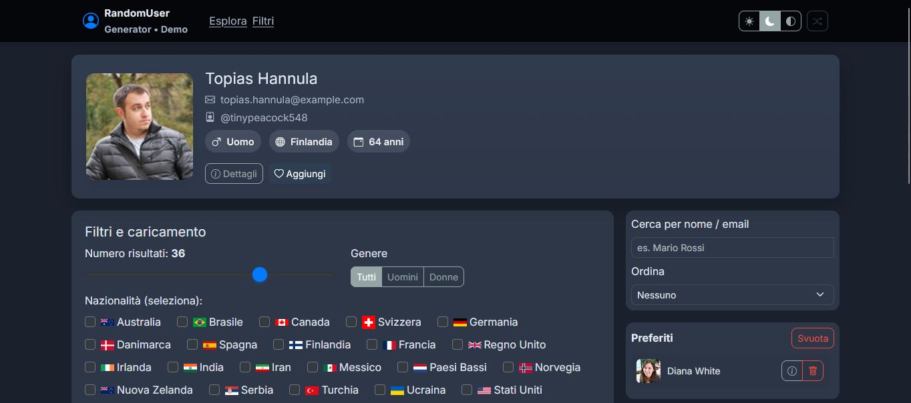

# Random User Generator

Un'applicazione web interattiva e **completamente responsive** che permette di generare, visualizzare e filtrare utenti casuali da tutto il mondo. Include funzionalità avanzate come la gestione dei preferiti, statistiche in tempo reale e un'interfaccia moderna con tema chiaro e scuro.

<!-- Inserisci qui uno screenshot dell'applicazione -->


---

## ✨ Funzionalità Principali

-   **Generazione Utenti Casuali**: Carica utenti con un click, specificando numero, genere e nazionalità.
-   **Filtri Avanzati**:
    -   Slider per il numero di risultati.
    -   Filtro per genere (uomo, donna, tutti).
    -   Selezione multipla delle nazionalità con bandiere.
-   **Ricerca e Ordinamento**: Cerca utenti per nome/email e ordina i risultati.
-   **Paginazione**: Naviga facilmente tra i risultati se superano il limite per pagina.
-   **Gestione Preferiti**: Salva i tuoi utenti preferiti (persistenti nel `localStorage`).
-   **Tema Chiaro/Scuro**: Cambia tema istantaneamente (Light, Dark, System).
-   **Statistiche Dinamiche**: Visualizza statistiche aggregate sui risultati caricati (es. % genere, età media).
-   **Visualizzatore Dettagli**: Apri una modale con informazioni complete su ogni utente.
-   **Esportazione JSON**: Visualizza o scarica i dati grezzi di un utente in formato JSON.
-   **Completamente Responsive**: Design ottimizzato per desktop, tablet e smartphone.

---

## 💻 Tecnologie Utilizzate

| Categoria      | Tecnologia                                                                                             |
| -------------- | ------------------------------------------------------------------------------------------------------ |
| **Core**       |                            |
|                |                              |
|                |           |
| **Framework**  |              |
| **Librerie JS**|                        |
|                |                            |
| **Design**     | [Bootswatch](https://bootswatch.com/flatly/) (Tema "Flatly")                                            |
|                | [Bootstrap Icons](https://icons.getbootstrap.com/)                                                     |
|                | [Google Fonts](https://fonts.google.com/specimen/Inter)                                                |
| **API**        | [RandomUser.me](https://randomuser.me/)                                                                |

---

## 🚀 Come Eseguire il Progetto in Locale

Per eseguire questo progetto, non è richiesto un server web complesso. È sufficiente un qualsiasi browser moderno.

1.  **Clona o scarica la repository:**
    ```bash
    git clone https://github.com/tuo-username/tuo-repository.git
    ```
2.  **Apri il file `index.html`:**
    Naviga nella cartella del progetto e fai doppio click sul file `index.html` per aprirlo direttamente nel tuo browser predefinito.

> **Nota**: Alcune funzionalità, come le richieste API, potrebbero essere bloccate dalle policy di sicurezza del browser (CORS) se il file viene aperto localmente. Per un'esperienza completa, è consigliabile servire i file tramite un server locale leggero.

**Usare un server di sviluppo (opzionale):**
Se hai `npm` installato, puoi usare `live-server`:
```bash
# Installa live-server globalmente (se non lo hai già)
npm install -g live-server

# Avvia il server nella cartella del progetto
live-server
```
Questo avvierà un server e aprirà l'app nel browser, risolvendo eventuali problemi di CORS.

---

## 📱 Design Responsive

L'interfaccia è stata progettata con un approccio *mobile-first* e utilizza le classi di utility di Bootstrap e media query personalizzate per garantire un'esperienza ottimale su tutti i dispositivi.

| Breakpoint        | Modifiche Principali                                             |
| ----------------- | ---------------------------------------------------------------- |
| **Mobile (<576px)** | Layout a singola colonna, font ridotti, UI compatta.             |
| **Tablet (≥768px)** | Layout a due colonne per i controlli, card più grandi.           |
| **Desktop (≥992px)**| Layout completo con pannello di controllo laterale e griglia estesa. |

*Ultimo aggiornamento: 26 dicembre 2025*
